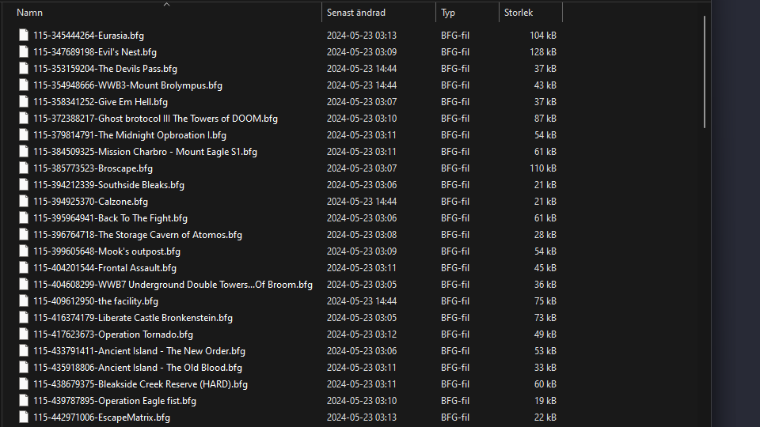

# Broforce Map Downloader

## 📋 Overview

The **Broforce Map Downloader** is perfect for those of you who've bought Broforce from a platform other than Steam or simply wish to play custom maps offline.<br> 
I designed this Python application to automate the process of downloading and organizing user-created maps based on specified filters such as gameplay type, difficulty level, time period and rating.

### 🌟 Features

- **Ready to Run**: Includes a batch file and executable for simple setup, ideal for users without Python installed.
- **Automated Map URL Fetching**: Fetches map URLs from Steam based on specified gameplay types, difficulty levels and time periods.
- **Map Downloading**: Downloads maps from the Steam Workshop.
- **Folder Organization**: Organizes downloaded maps into directories based on their rating.
- **File Organization**: Each file is named with the gameplay type, difficulty and star rating for easy identification of map characteristics.
- **Configurable Settings**: Customizable settings through a configuration file (`config.ini`).
- **Error Handling**: Robust error-handling mechanisms including retries and exponential backoff for HTTP requests.

<br>

## ⚙️ Installation

### 🎮 For Regular Users (Standalone Executable)

If you are planning to use the standalone executable version of the application, follow these simple steps:

1. **Download the Executable**:
   Download the [.exe](https://github.com/hodel33/broforce-map-downloader/raw/main/broforce_map_downloader.exe), 
   [config.ini](https://github.com/hodel33/broforce-map-downloader/raw/main/config.ini), and 
   [readme.txt](https://github.com/hodel33/broforce-map-downloader/raw/main/readme.txt)
    files from the repo. The config.ini and readme.txt files are necessary for running the application and understanding its usage.
    > Please ensure to save the config file with the `.ini` extension if your browser suggests saving it as `.txt`.

2. **Configure Settings**:
   Edit the `config.ini` file to set your preferences for map types, difficulty levels and other parameters as described in the `readme.txt`.

3. **Run the Application**:
   Double-click on the executable file to start downloading maps according to your configured settings.

<br>

### 💻 For Developers

If you want to run the batch file or modify the Python code follow these detailed steps:

#### 🛠️ Prerequisites

1. 🐍 **Python**: This application is written in Python 3. Ensure you have Python installed. You can download it from [Python's official website](https://www.python.org/downloads/).

2. 🖋️ **IDE**: For code editing, [VS Code (Visual Studio Code)](https://code.visualstudio.com/) is recommended. Enhance your Python experience by adding the [Python extension](https://marketplace.visualstudio.com/items?itemName=ms-python.python).

3. 📦 **Dependencies**: The required Python packages are listed in `requirements.txt`. You can install them automatically with the command `pip install -r requirements.txt`.

#### ⬇️ Steps

1. **Clone the Repository**:  
   Clone this GitHub repository to your local machine.
   ```bash
   git clone https://github.com/hodel33/broforce-map-downloader.git
   ```

2. **Navigate to Project Directory**:  
   Open a terminal and navigate to the directory where you've cloned the repository.
   ```bash
   cd path/to/broforce-map-downloader
   ```

3. **Install Dependencies**:  
   Run the following command to install the required Python packages.
   ```bash
   pip install -r requirements.txt
   ```

4. **Set Up Configuration**:  
   Update the `config.ini` file with your preferred settings.

5. **Run the Application**:

   - **Using the Batch File**:
     Locate the `broforce_map_downloader.bat` file in the project directory and double-click on it to start the application.
   
   - **Using the Terminal**:
     Open a terminal, navigate to the project directory, and run the application with the following command:
     ```bash
     python broforce-maps-downloader.py
     ```

<br>

## 🚀 Usage (Running the app)

### Main Menu

Upon launching the application, the main menu displays the current settings from the `config.ini` file and waits for the user to initiate the map downloading process.

<br>


<br>

### Download Maps

- **Fetching Map URLs**: The application searches for map URLs from Steam using specified gameplay types, difficulty levels and time periods. It intelligently skips maps that have already been downloaded.

<br>


<br>

- **Downloading Maps**: Once the map URLs are collected, the application downloads the maps trough [Steam Workshop Download](http://steamworkshop.download) and stores them in the 'maps' directory on your local machine.

<br>


<br>

- **Organizing Maps**: After all maps have been downloaded, they are automatically sorted into subdirectories for easier access, organized based on their star rating. Additionally, each map file is systematically named to reflect its gameplay type, difficulty and star rating, allowing for quick identification of the map's characteristics.

<br>



<br>

## 🔧 Usage (Configuration)

### Customizable settings

The application's behavior is controlled by the `config.ini` file. Below is a sample configuration:

```ini
[Settings]
number_of_pages = 3        # Number of pages to process: Defines how many pages of map listings to fetch from the Steam Workshop.
maps_per_page = 18         # Number of items per page (options: 9, 18, 30): Determines how many maps are listed on each page to be processed.
time_period = -1           # Time period in days: Filters maps based on their upload time (-1 for all time, other options: 1, 7, 90, 180, 365).
gameplay_types = 1235      # Gameplay types to include (mapping below): Specifies the types of gameplay for the maps to be fetched.
difficulty_levels = 123    # Difficulty levels to include (mapping below): Determines the difficulty levels of the maps to be fetched.
```

#### Gameplay Types
- `1` - **Standard**: Typical Broforce gameplay.
- `2` - **Puzzle**: Maps that involve puzzles and strategic gameplay.
- `3` - **Story**: Maps that focus on narrative elements.
- `4` - **Experimental**: Maps that introduce unique, unconventional gameplay mechanics.
- `5` - **Challenge**: Maps designed to test player skills with difficult tasks.
- `6` - **Deathmatch**: Maps suited for player versus player combat.

#### Difficulty Levels
- `1` - **Normal**: Standard difficulty, suitable for most players.
- `2` - **Challenging**: Higher difficulty requiring more skill and strategy.
- `3` - **Brotal**: Extremely difficult, designed for experienced players.

## 📂 Usage (Filename organization)

### ID Structure

This section details how downloaded map files are systematically named and organized, making it easy to identify and sort maps based on their specific attributes like gameplay type, difficulty level and star rating:

-----------------------------------------
	XYZ-123456789-Map Title.bfg
-----------------------------------------

- **123456789**: Workshop ID for the map

- **X - Gameplay Type:**
  - `1` - Standard
  - `2` - Puzzle
  - `3` - Story
  - `4` - Experimental
  - `5` - Challenge
  - `6` - Deathmatch

- **Y - Difficulty Level:**
  - `1` - Normal
  - `2` - Challenging
  - `3` - Brotal

- **Z - Star Rating:**
  - `0` - Not enough ratings
  - `1` - 1 Star
  - `2` - 2 Stars
  - `3` - 3 Stars
  - `4` - 4 Stars
  - `5` - 5 Stars

<br>

## 📜 License

This project is licensed under a Custom License - see the [LICENSE](LICENSE) file for details.<br>
The license restricts the use of the software to personal, non-commercial purposes and prohibits both the distribution and the sale of the software.


### Summary:

1. **Personal Use**: The software may not be used for any commercial purposes.
2. **No Distribution**: The software may not be distributed or included in any larger software distributions.
3. **No Sale**: The software may not be sold.

For the full license, please refer to the [LICENSE](LICENSE) file in the repository.

<br>

## 💬 Feedback & Contact

I'd love to network, discuss tech, or swap music recommendations. Feel free to connect with me on:

🌐 **LinkedIn**: [Björn Hödel](https://www.linkedin.com/in/bjornhodel)<br>
🐦 **Twitter**: [@hodel33](https://twitter.com/hodel33)<br>
📸 **Instagram**: [@hodel33](https://www.instagram.com/hodel33)<br>
📧 **Email**: [hodel33@gmail.com](mailto:hodel33@gmail.com)
